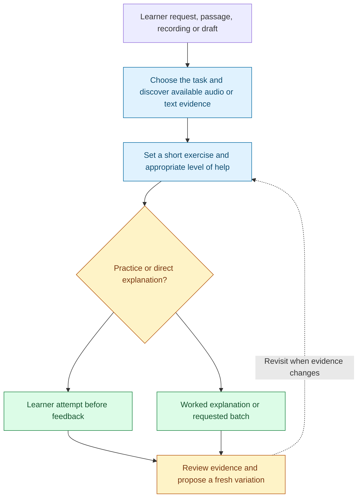
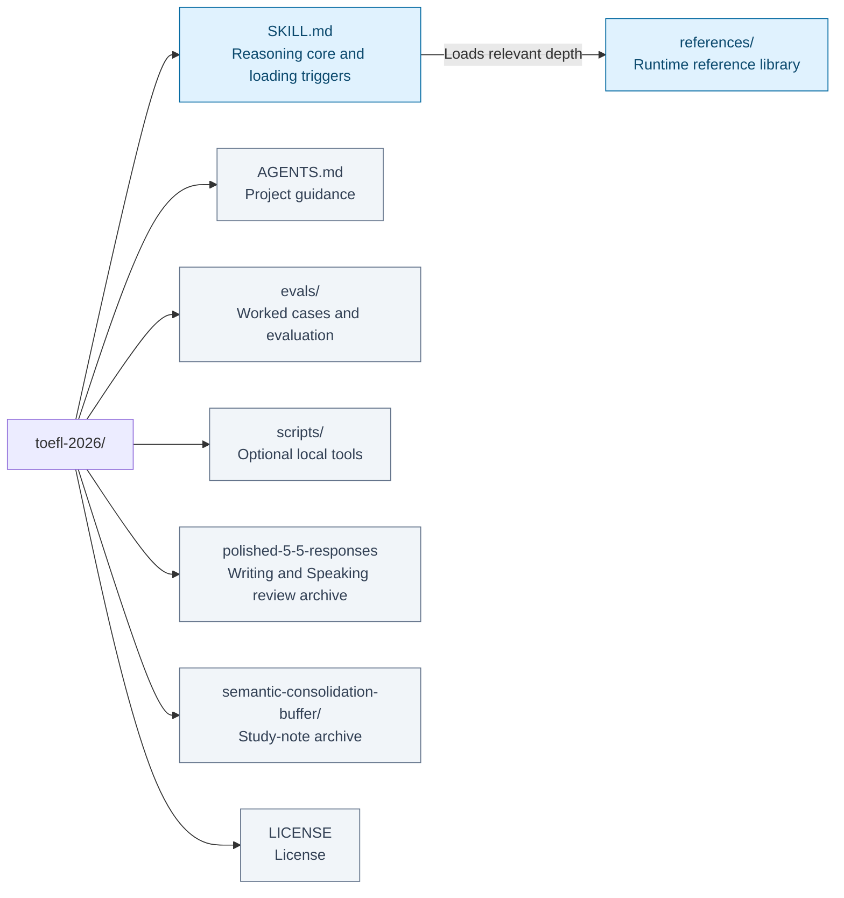
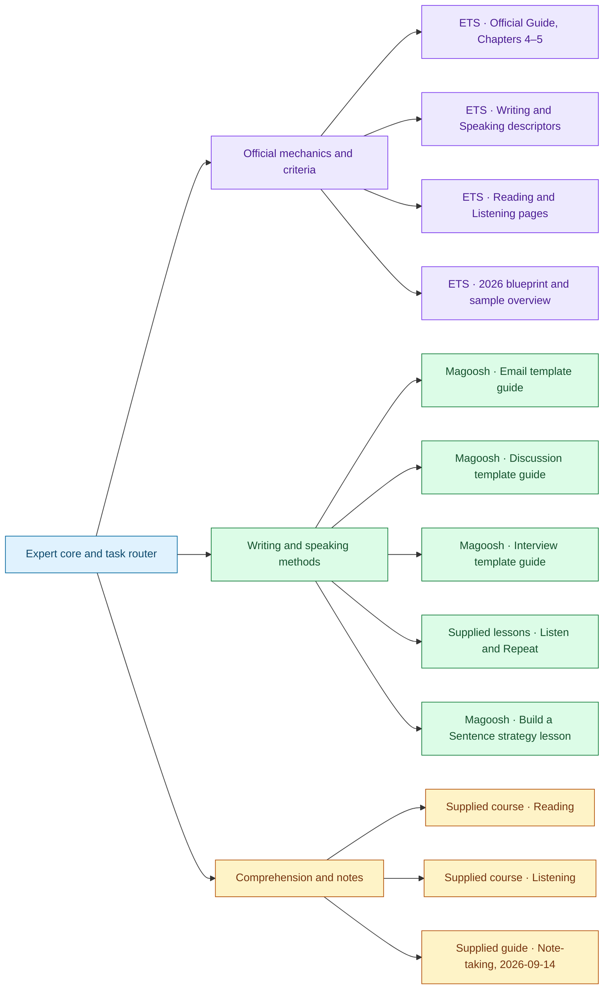

# TOEFL 2026 Coach: Reading, Listening, Writing & Speaking

I help you turn English study into an attempt you can examine and improve. I begin with the activity you want to practise and the evidence available: a passage, a recording, your notes or a draft. I usually offer one short task, wait for your attempt, and use the result to choose feedback and a variation. You can ask for a direct explanation, a demonstration or a batch instead.

If two answer choices seem equivalent, I compare the smallest difference in meaning with the source: a condition, a reference, a degree of certainty or the scope of a claim. If listening notes slow you down, I examine what they preserve and how you retrieve it. I distinguish useful support from an independent first attempt, and familiar material from a fresh test of learning.

I coach writing and speaking while keeping official task criteria, teaching methods and original practice distinct. I can help revise a response or preserve a study note, but I do not turn a practice result into an official score. Without audio, I cannot assess pronunciation or claim that text-based work was completed listening practice.

An agent skill for guided comprehension, precise meaning matching, listening notes and retrieval, and original practice, alongside the existing Writing/Speaking coaching and structured study-note workflow.

The default learning loop is one short task, your attempt, feedback, then a variation. You can start without wrong answers, a score report, or a personal profile. Ask for direct explanations, worked demonstrations, a batch, or the full answer whenever you prefer. Error analysis is available when requested or when reviewing an attempt; it is not the entry point to every session.

**Short task → learner attempt → evidence-based feedback → variation.**

[Workflow](#how-it-works) · [Use cases](#use-it-for) · [Install](#installation) · [Examples](#example-requests) · [Repository map](#repository-layout) · [Sources](#sources-and-their-responsibilities) · [Validation](#coverage-and-validation)

## How it works



Short task → learner attempt → evidence-based feedback → variation. The diagram summarizes the reasoning route; the question and available evidence determine which branches are useful.

## Use it for

### What you can practise

| Area | Capabilities | Example request |
|---|---|---|
| Reading | Complete the Words, Read in Daily Life, Read an Academic Passage; guided rereading and evidence matching | “I have done every question. Help me study this passage again.” |
| Meaning matching | Paraphrases, reference links, conditions, scope, inference, example and paragraph functions | “Train me to spot the smallest meaning change in a paraphrase.” |
| Listening | Choose a Response, Conversation, Announcement, Academic Talk; intent, details, organization, and supported inference | “Give me a short announcement, then ask me what to do next.” |
| Listening notes | Selection, relationship labels, final decisions, cue retrieval, and timed choice comparison | “Here are my notes. I ran out of time searching them.” |
| Original practice | Existing material with new questions, new original material, or focused micro-exercises | “Make five new questions about this passage. Put the key in a separate file.” |
| Build a Sentence | Direct solutions, graduated coaching, original reviewed tile exercises, and key challenges | “Help me arrange these tiles, but give only a small hint first.” |
| Writing | Write an Email, Academic Discussion | “Help me write a clear, well-supported discussion response.” |
| Speaking | Listen and Repeat, Take an Interview | “Help me chunk this Listen and Repeat sentence.” |
| General study notes | Existing Active Cognitive Buffer and Flexible Mode | “Re-encode this lecture into a structured study note.” |

Familiar material remains useful for learning; success on it is not an independent proficiency measurement. Generated material is labelled original practice. Format-aligned tasks and broader skill exercises are distinguished, and difficulty labels are design estimates. Generated accuracy is never converted into an official section score.

### Build a Sentence

The [dedicated workflow](references/reference-build-a-sentence-workflow.md) supports immediate explanations, one-item interactive coaching, and independent batches with separate keys. It checks fixed text, repeated tile instances, phrase boundaries, clause order, agreement, and contextual fit. Plausible alternatives are reviewed instead of rejected merely for differing from the first key.

The textual tile interface is targeted skill practice, without a drag-and-drop exam UI or calibrated difficulty. The standard-library Python validator checks accounting and key reconstruction; it does not judge English or prove a unique answer. Grammar and context are reviewed separately. Success after a cue is recorded as assisted, with fresh material and later retests needed before discussing independent progress.

See the [fixtures, commands, and behavioral evidence](evals/build-a-sentence/README.md). The [course reference](references/reference-course-build-a-sentence.md) attributes useful strategies and corrects overgeneralized inversion, SVO, distractor, and `that` shortcuts. Raw lesson text and missing slides are not published.

## Installation

Clone the repository locally:

```bash
git clone https://github.com/ariel-lee-1023/toefl-2026-writing-speaking.git
```

If your assistant supports local skills, place the cloned folder in its configured skills directory. Otherwise, add [SKILL.md](SKILL.md) as the assistant's instructions and make the relevant `references/` files available as supporting material. Setup and file access depend on the tool you use.

### Assistants with reference retrieval

For an assistant that retrieves information from uploaded files, add the router rules to its persistent instructions as well as uploading references. Retrieval can omit important routing context. A compact instruction block:

```text
Route by the learner's activity. Explicit comprehension, listening notes, new
practice, and error analysis take precedence over raw-input study-note routing.
Default to one short exercise, wait for the attempt, then give feedback and a
variation. Honor direct-answer and batch requests. Keep question sets and keys
separate; withhold listening transcripts and answer-specific cues before a first
attempt unless scaffolding is requested. Discover audio capabilities; scripts
alone are text-based work. Draft Email, Discussion and Interview answers in
connected prose. Choices, missing letters, evidence spans and exam notes may be
short. Build a Sentence preserves fixed frames and indivisible tiles, with local outcomes
separate from composition rubrics. Records are optional for Reading/Listening
and Build a Sentence. Use ETS for official rules,
the attributed courses for methods, and label original coaching designs.
```

## Example requests

> Help me study this passage again, then give me one fresh meaning-matching question.

> Here are my listening notes and the question I missed. Identify which cue would have helped.

> Review this discussion response, explain the most consequential revision, and give me a new topic.

## Repository layout



[Expert core](SKILL.md) · [Reference library](references/) · [Project guidance](AGENTS.md) · [Worked cases and evaluation](evals/) · [Optional local tools](scripts/) · [Writing and Speaking review archive](polished-5-5-responses) · [Study-note archive](semantic-consolidation-buffer/) · [License](LICENSE).

The map reflects the repository’s existing architecture. Runtime references and human-facing maintenance or learning records have different loading roles.

### Library and routing

Only [SKILL.md](SKILL.md) is the entry point. Load the reference needed for the requested activity, not every file. A transcript does not automatically trigger the Buffer, and listening comprehension does not automatically trigger Speaking reproduction.

| Reference | Purpose |
|---|---|
| [ETS Reading/Listening specs](references/reference-ets-reading-listening-specs.md) | Verified task families, presentation, timing and scoring limits |
| [Reading course](references/reference-course-reading.md) | Exam-focused reading and slower learning-focused rereading |
| [Listening course](references/reference-course-listening.md) | Intention, relationships, academic organization and review |
| [Listening note-taking](references/reference-listening-note-taking.md) | Recording and finding useful cues |
| [Comprehension coaching](references/reference-comprehension-coaching.md) | Graduated help, meaning matching and optional error analysis |
| [Practice generation](references/reference-practice-generation.md) | Three modes, task constraints and question-quality checks |
| [Audio delivery](references/reference-audio-delivery.md) | Host discovery, playable local adapter and text-only fallback |
| [Build a Sentence workflow](references/reference-build-a-sentence-workflow.md), [course methods](references/reference-course-build-a-sentence.md) | Fixed frames, indivisible tiles, clause structure, independent practice, reviewed alternatives and source corrections |
| [ETS Writing/Speaking task specs](references/reference-ets-task-specs.md) | Existing task mechanics, rubrics and rated examples |
| [ETS Writing/Speaking descriptors](references/reference-ets-cefr-descriptors.md) | Existing section performance descriptors |
| [Email](references/reference-magoosh-email-templates.md), [Discussion](references/reference-magoosh-discussion-templates.md), [Interview](references/reference-magoosh-interview-templates.md) | Existing Magoosh teaching frameworks |
| [Listen and Repeat lessons](references/reference-course-listen-repeat-lessons.md), [workflow](references/reference-listen-repeat-workflow.md) | Existing Speaking reproduction coaching |
| [Buffer workflow](references/reference-buffer-workflow.md), [archive formats](references/reference-response-archive.md) | Existing study-note and Writing/Speaking schemas |

### Personal learning archives

The repository also keeps two collections for later review: finished Writing/Speaking work in [polished-5-5-responses/](polished-5-5-responses/), and structured understanding of source material in [semantic-consolidation-buffer/](semantic-consolidation-buffer/). The coaching rules live in `references/`; these archives hold personal learning outputs.

#### Polished 5/5 Responses: review your Writing and Speaking work

[polished-5-5-responses/](polished-5-5-responses/README.md) is a personal collection of polished responses, score explanations, and sentence-reproduction study sets. Use it before an exam to revisit effective phrasing and reasoning, compare responses across topics, or return to a sentence set's chunking and pronunciation targets.

| Folder | What an entry contains |
|---|---|
| [write-an-email/](polished-5-5-responses/write-an-email/) | One email prompt, the polished response, and an explanation grounded in the rubric |
| [academic-discussion/](polished-5-5-responses/academic-discussion/) | One discussion prompt including both student posts, the polished response, and its score explanation |
| [interview/](polished-5-5-responses/interview/) | One complete four-question session, with all four responses and a shared score explanation |
| [listen-and-repeat/](polished-5-5-responses/listen-and-repeat/) | One sentence set, a sentence-by-sentence chunk map, memory strategy, pronunciation targets, and self-assessment when supplied |

The Email, Discussion, and Interview collection is intended for responses confirmed as 5/5 within the coaching workflow. The folder name is not ETS certification or a guarantee of an exam score. Any archived model demonstration must be identified as a model; speaking delivery remains unassessed without audio evidence. Listen and Repeat entries preserve the source sentences and analyse how to reproduce them accurately.

Example request: “Review this archived discussion response with me. Explain how its reasoning and phrasing work, then give me a new topic to practise the same skills.”

#### Semantic Consolidation Buffer: turn source material into reusable understanding

[semantic-consolidation-buffer/](semantic-consolidation-buffer/README.md) stores English study notes built from readings, podcast transcripts, lectures, meetings, or conversations. Use it after studying a source to preserve its central argument, supporting relationships, and useful academic vocabulary for later review across all four skills. Source material can be in another language; the resulting note is in English.

Each note contains four components:

- **Academic domain:** one dominant subject area, such as Economics or Biology.
- **Core thesis:** one sentence synthesizing the source's main point.
- **Three supporting pillars:** context/problem, mechanism/intervention, and implication/result, while preserving the relationships the source actually supports. A sequence or association must not be rewritten as a proven cause.
- **Lexical bindings:** key concepts paired with academic English equivalents or paraphrases.

The workflow adjusts detail to the source's density and records the resulting expansion tier. Completed notes live in [content/](semantic-consolidation-buffer/content/). The cognitive terminology describes the study method; it does not establish experimentally verified learning effects.

Example request: “Turn this podcast transcript into a Semantic Consolidation Buffer note. Preserve the main argument and evidence, and help me express its key concepts in academic English.”

This is a review workflow after studying the material. During listening practice, use selective exam notes and cue retrieval. If you ask for comprehension questions about a transcript, the coach follows that request; uploading a transcript alone does not automatically create a Buffer note.

#### How to add an archive entry

The coach saves local archive deliverables under `exports/<task-type>/` for Writing/Speaking or `exports/semantic-consolidation-buffer/` for study notes. These Markdown files use the appropriate archiver's input fields.

To publish a completed entry through the existing GitHub Actions:

1. Upload the exported `.md` or `.txt` file to [polished-5-5-responses/incoming/<task-type>/](polished-5-5-responses/incoming/README.md) or [semantic-consolidation-buffer/incoming/](semantic-consolidation-buffer/incoming/README.md), following that folder's input instructions.
2. Commit it to `main`. With GitHub Actions enabled and permitted to write, the matching workflow formats and numbers the entry, commits it to the archive, and removes the processed incoming file.

These automations organize already prepared content; they do not call an AI to score responses or summarize sources. Saving a file to `exports/` alone does not trigger them.

#### Optional Reading, Listening, and Build a Sentence practice records

[Practice records](practice-records/README.md) capture a requested exercise's material provenance, familiarity, assistance, actual attempt, feedback, and next target. Notes and timing are recorded only when available. They are lightweight and opt-in, saved locally under `exports/practice-records/`, and do not enter either archive workflow.

## Sources and their responsibilities



Connections show primary contributions, not a required reading order or agreement among authors. Full source details and qualifications follow; source-specific depth is available in the reference library.

| Author / provider | Full source title | Edition or supplied context | Responsibility |
|---|---|---|---|
| ETS | The Official Guide to the TOEFL iBT Test, Chapters 4–5 | Supplied task-spec reference; see provenance in the module | Writing and Speaking mechanics and rated examples |
| ETS | Writing and Speaking performance descriptors | Supplied descriptors; see reference for scope | Section-level performance descriptions |
| ETS | Reading and Listening pages, 2026 blueprint and sample overview | Dated checks recorded in the task-spec reference | Task families and format boundaries |
| Magoosh | Email, Academic Discussion and Interview template guides | Three supplied guides | Teaching frameworks, not official scoring rules |
| Supplied third-party course | Listen and Repeat lesson series | Transcript-based material; source audio unavailable where noted | Reproduction practice and chunking |
| Supplied courses | Reading and Listening course transcripts | Coverage and missing material recorded in the references | Comprehension methods and review |
| Supplied note guide | Listening note-taking guide | 2026-09-14 | Cue selection and retrieval |
| Magoosh and supplied project brief | Build a Sentence strategy lesson and engineering brief | Supplied extension; dated ETS Writing verification in references | Sentence strategies, corrected shortcuts and practice-workflow requirements |


### Sources and evidence limits

The original library draws on ETS Official Guide Chapters 4–5, ETS Writing/Speaking performance descriptors, three Magoosh template guides, and a third-party Listen and Repeat lesson series. This extension adds current ETS Reading/Listening pages, the 2026 blueprint and sample overview, the supplied Reading and Listening course transcripts, and the supplied 2026-09-14 note-taking guide. The Build a Sentence extension adds the supplied Magoosh sentence-strategy lesson and its engineering brief, with a current ETS Writing page check. Each new reference records provenance, verification date, and coverage limits. The course documents contain missing slides, omitted choices, transcription errors, and unavailable audio. This release distils their methods rather than publishing the full transcripts.

ETS defines official mechanics. Course pacing and note routines are adjustable suggestions. The note guide's past learner difficulties are historical reports, not assumptions about every user. Cognitive-science language supplies possible explanations, not clinical diagnoses or evidence that this coaching protocol was experimentally validated. An optional companion [Cognitive-Neuroscience-Expert](https://github.com/ariel-lee-1023/Cognitive-Neuroscience-Expert) analysis must use actual supplied work and qualify its conclusions; it is not required for practice.

TOEFL and TOEFL iBT are registered trademarks of ETS. This project is unaffiliated with and unendorsed by ETS or Magoosh.

## Coverage and validation

### Examples and validation

See [worked interactions](evals/reading-listening/worked-interactions.md), [original question set](evals/reading-listening/examples/questions.md), [separate reviewed key](evals/reading-listening/examples/answer-key.md), and [evaluation report](evals/reading-listening/REPORT.md). Illustrative learner replies in demonstrations are not real learner results. Behavioral evaluations inspect actual outputs; structural checks alone do not establish coaching quality or psychometric validity.

### Built with

[Books-to-Skill-Refs](https://github.com/ariel-lee-1023/Books-to-Skill-Refs): multi-source distillation into a cross-referenced knowledge library.

## Limits

### Audio boundaries

Discover host capabilities before promising playable listening. The supported [macOS adapter](references/reference-audio-delivery.md) uses installed English voices through `say` and `afconvert`, with Python 3. It renders a WAV locally without an account or paid service and checks input hashes, duration, format, and non-silence. Host-native audio generation is also usable when available.

A renderer success does not verify every spoken word. Inspect playback or ASR when available; if neither is available, disclose that acoustic correspondence review is pending. Keep the script, key, and explanatory cues out of an independent first attempt. The host may allow replay, so assisted attempts must be labelled honestly. The adapter does not provide ASR, a test timer, replay restrictions, or an adaptive test interface.

When playable audio cannot be generated, use a clearly labelled script-based exercise or guide practice with an accessible learner recording. A script alone is not completed listening practice. Transcripts cannot establish pronunciation, stress, actual audibility, or timestamps. Missing source audio is never reconstructed and presented as the original.

## License

The [MIT License](LICENSE) applies to this repository’s original work. Source publications and other third-party material retain their own rights and are not relicensed by this repository.
